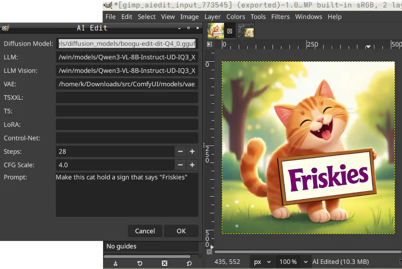

# GIMP 3 AI Plugins



A collection of Python-based AI plugins for **GIMP 3** (GNU Image Manipulation Program), using the GIMP 3 Python API via PyGObject introspection.

## Plugins

| Plugin | What it does | How it works | Dependencies |
|--------|-------------|--------------|--------------|
| **Background Remove** (`bgremove/`) | Removes backgrounds from images using AI | Exports layer → runs `backgroundremover` CLI → imports result as new transparent layer | `backgroundremover` (PyPI) |
| **AI Upscale** (`upscale/`) | Upscales images 4× using AI upscalers | Exports layer → runs PyTorch upscaler (3 backends) → imports result as new upscaled layer | `torch`, `pillow`, `image_gen_aux` / `diffusers` |
| **AI Edit** (`aiedit/`) | Edits images using text prompts via a diffusion model and vision LLM | Exports layer → runs `sd-cli` with a diffusion GGUF model + vision LLM → imports edited result as new layer | `sd-cli` (stable-diffusion.cpp), diffusion GGUF, vision LLM GGUF, VAE |
| **Test Plugin** (`test_plugin/`) | Minimal skeleton plugin | Hello-world GIMP 3 `Gimp.PlugIn` subclass | — |

## Security

**Arbitrary command execution.** Plugins for most applications can run any commands. This is not new. Open source relies on the community to find and fix bugs and exploits. You should always review new source code or test in a sandbox.

## Requirements

- **GIMP 3.0+** — these plugins use the GIMP 3 Python API (`gi.require_version('Gimp', '3.0')`)
- **Python 3** — GIMP 3 ships with its own Python environment
- **CUDA-capable GPU** — strongly recommended for the upscale, image edit plugins.

## Installation

### 1. Install plugin dependencies

The `install.py` installer (experimental) will attempt to perform these steps. Developers & power users may want fine-grained control & knowledge of install locations here:

**AI Edit**

The AI Edit plugin uses `sd-cli` from stable-diffusion.cpp (not a Python package). See [aiedit/README.md](aiedit/README.md) for model downloads and setup.

**Others.** Other plugins have their own Python dependencies. The installer will attempt to install these dependencies with `pip`.

```shell
# For Background Remove
pip install backgroundremover

# For AI Upscale
pip install image_gen_aux diffusers torch pillow
```

### 2. Place plugins in GIMP's plug-ins directory

The installer looks for the highest-numbered GIMP/xx.x/plug-ins directory.

```shell
git clone https://github.com/themanyone/gimp-plugins.git
cd gimp-plugins
ln -srf bgremove ~/.config/GIMP/3.2/plug-ins/
ln -srf aiedit ~/.config/GIMP/3.2/plug-ins/
# install additional plugins the same way
```

### 3. Restart GIMP

After restart, the plugins appear in the GIMP menu:
- **AI Image**: File → Create → AI Image...
- **Background Remove**: Filters → AI → Remove Background...
- **AI Upscale**: Filters → AI → Upscale...
- **AI Image Edit**: Filters → AI → AI Edit...
- **Test Plugin**: Filters → AI → Test Plugin

## Plugin architecture

Every plugin follows the same pattern:

```
export layer as temp PNG → process (CLI or ML) → load result → new layer → copy pixels
```

See [AGENTS.md](AGENTS.md) for the full architecture guide and development notes.

## Customizing

Dialog presets are saved in `~/.config/gimp-plugins/aiedit/presets.json` but you can load, save, and rename them at runtime.

### Background Remove

- This works with existing tools.
- Let's assume you have installed `backgroundremover`.

Don't want to use `backgroundremover`?
- Install any old command-line AI tool to remove backgrounds from images.
- You can use `pip install rembg` for example.
- Edit `bgremove/bgremove.py` and modify the `command` list to use a different CLI tool (e.g., `rembg` instead of `backgroundremover`).

### AI Upscale

Scale it down first. Start with 1024x1024 pixels to upscale to 4K resolution. Larger images will take a lot longer. And without enough VRAM many upscalers will crash.

The Upscale plugin prompts you to choose an AI model when you use the plugin in Gimp. And it allows you to save preferences. Models are downloaded automatically, so it might take some time to upscale your first image.

It is not necessary to edit `upscale/upscale.py` to:
- Change `DEFAULT_MODEL` or any key in `MODEL_CONFIGS`
- Add new upscaling models with appropriate config
- Tune inference parameters (tile_size, steps, noise_level, etc.)
...but you can!

### AI Image

Edit [aiimage.py](aiimage/aiimage.py) and set `MODELS_PATH` to where your models are. Or just enter the full path to each model into the dialog at runtime and save preferences. We are reusing our ComfyUI models but yours will be somewhere else.

**Z Image Turbo.**

Z Image Turbo is mainly for new image generation. It is not really cut out for Img2Img editing. They are supposed to be coming out with a Z Image Edit model later. And it won't work with Kontext (style transfer). You could edit the code with model locations. Or you can enter them into the dialog at runtime. Try generating small images first.

```python
DEFAULT_DIFFUSION_MODEL = MODELS_PATH + "/diffusion_models/z-image-turbo-Q5_K_M.gguf"
DEFAULT_LLM = MODELS_PATH + "/text_encoders/qwen_3_4b.safetensors"
DEFAULT_LLM_VISION = ""
DEFAULT_VAE = MODELS_PATH + "/vae/ae.safetensors"
```

You can also generate images using AI Edit models below.

### AI Edit

Scale images down to 512x512 or lower for testing AI Edit. Larger images will take a lot longer. Try larger images after it works well.

The AI Edit plugin runs `sd-cli` from stable-diffusion.cpp with a diffusion model and vision LLM. Default model paths are configured at the top of `aiedit/aiedit.py` for example:

**Boogu Edit.**

This is a Kontext model. Kontext mode should be set automatically, and Guidance will be set to 0.0. You can change them but it is not recommended. You can also create new images with these by entering them into the AI Image dialog under File -> Create. This model has worked well for adding characters and text to images.

```python
DEFAULT_DIFFUSION_MODEL = MODELS_PATH + "/diffusion_models/boogu-edit-dit-Q4_0.gguf"
DEFAULT_LLM = LLM_PATH + "/Qwen3-VL-8B-Instruct-UD-IQ3_XXS.gguf"
DEFAULT_LLM_VISION = LLM_PATH + "/mmproj-F16.gguf"
DEFAULT_VAE = MODELS_PATH + "/vae/ae.safetensors"
```

**Flux 2 Klein.**

This is an older & smaller img2img model but it should work. Img2img mode should be set, and Guidance set to 3.5. Download these models and enter their locations into the image editing dialog and save it. You could also create new images with them the same way.

```python
diffusion model: flux-2-klein-4b-Q4_K_S.gguf
clip_l: clip_l.safetensors
llm: Qwen3-4B-Instruct-2507-UD-Q4_K_XL.gguf
vae: flux2-vae.safetensors"

```

All paths can be overridden in the GIMP dialog at runtime. To change the defaults, edit these variables at the top of `aiedit.py` or adjust the `MODELS_PATH` / `LLM_PATH` base directories. 

## License

This software is Copyright (2026) by **Henry Kroll III** ([@themanyone](https://github.com/themanyone)) under [GNU General Public License v3.0](LICENSE)

    This program is free software: you can redistribute it and/or modify
    it under the terms of the GNU General Public License as published by
    the Free Software Foundation, either version 3 of the License, or
    (at your option) any later version.

    This program is distributed in the hope that it will be useful,
    but WITHOUT ANY WARRANTY; without even the implied warranty of
    MERCHANTABILITY or FITNESS FOR A PARTICULAR PURPOSE.  See the
    [GNU General Public License](LICENSE) for more details.

    You should have received a copy of the GNU General Public License
    along with this program.  If not, see <https://www.gnu.org/licenses/>.

For any other uses, contact the author.

## Author

**Henry Kroll III** ([@themanyone](https://github.com/themanyone))

## Thanks for trying out gimp-plugins!
* GitHub https://github.com/themanyone
* YouTube https://www.youtube.com/themanyone
* Mastodon https://mastodon.social/@themanyone
* Linkedin https://www.linkedin.com/in/henry-kroll-iii-93860426/
* Buy me a coffee https://buymeacoffee.com/isreality
* TheNerdShow.com https://thenerdshow.com

